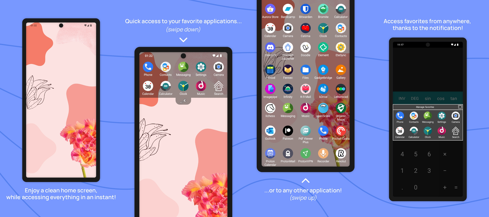

# Discreet Launcher *(Lanceur Discret)*

Enjoy a clean home screen while accessing everything in an instant!  
*(Profitez d'un écran d'accueil épuré tout en accédant à tout en un instant !)*

**Available on [F-Droid](https://f-droid.org/en/packages/com.vincent_falzon.discreetlauncher) and [Google Play](https://play.google.com/store/apps/details?id=com.vincent_falzon.discreetlauncher)**
*(disponible sur [F-Droid](https://f-droid.org/fr/packages/com.vincent_falzon.discreetlauncher) et [Google Play](https://play.google.com/store/apps/details?id=com.vincent_falzon.discreetlauncher))*

  
Please note that the F-Droid build and publishing process is automatic and usually take 4 to 8 days to complete.
You may see a gap between the latest release and what is really available on F-Droid.  
*(Le processus de compilation et de publication par F-Droid est automatique et prend généralement 4 à 8 jours.
Il y a donc parfois une différence entre la dernière version et ce qui est disponible sur F-Droid.)*

## Maintenance status *(État de maintenance)*

Due to changes in my professional life, I now have very little time to work on Discreet Launcher. The development will continue, but at a much slower pace. You can find more details in ticket [#210](https://github.com/falzonv/discreet-launcher/issues/210).  
*(Suite à des changements dans ma vie professionnelle, j'ai maintenant très peu de temps pour travailler sur Lanceur Discret. Le développement va continuer, mais à un rythme beaucoup plus lent.)*

## Screenshots *(Captures d'écran)*

