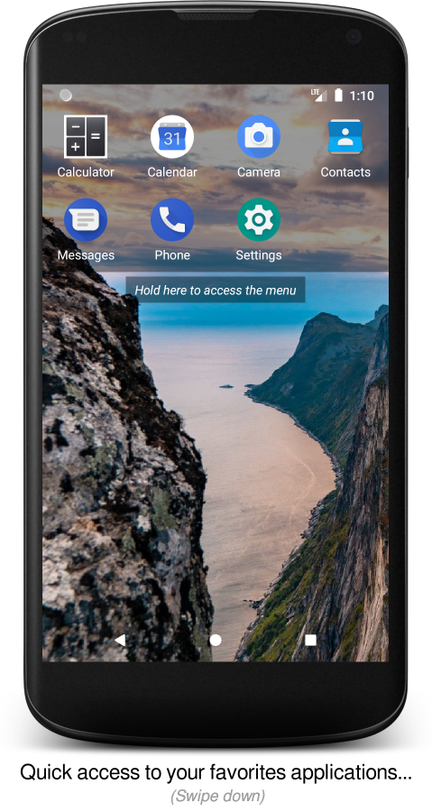
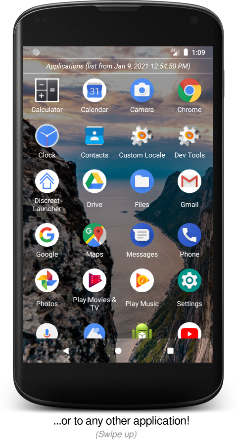
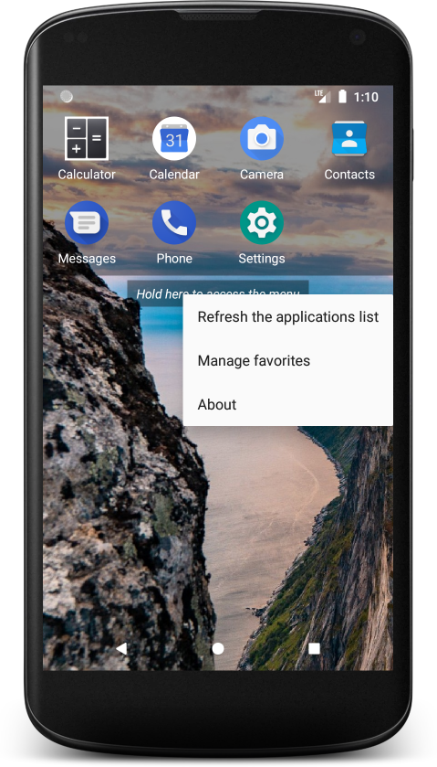

# Discreet Launcher

Enjoy a clean home screen while accessing everything in an instant!

**Available on: [F-Droid](https://f-droid.org/en/packages/com.vincent_falzon.discreetlauncher) and [Google Play](https://play.google.com/store/apps/details?id=com.vincent_falzon.discreetlauncher)**

Discreet Launcher provides you a distraction-free home screen, allowing you to fully enjoy your
wallpaper (only the status and navigation bars have been kept for convenience).

From this clean home screen, simply slide your finger down to display your favorites applications
or up to see the complete list of applications.

Both for speed and to limit battery usage, the list of installed applications is fetched only when
Discreet Launcher starts. You can refresh it at any time from the menu, for example if a newly
installed application does not appear.

Discreet Launcher is open source, doesn't require any unnecessary permission, works completely
offline and doesn't include any advertisements.

## Screenshots

