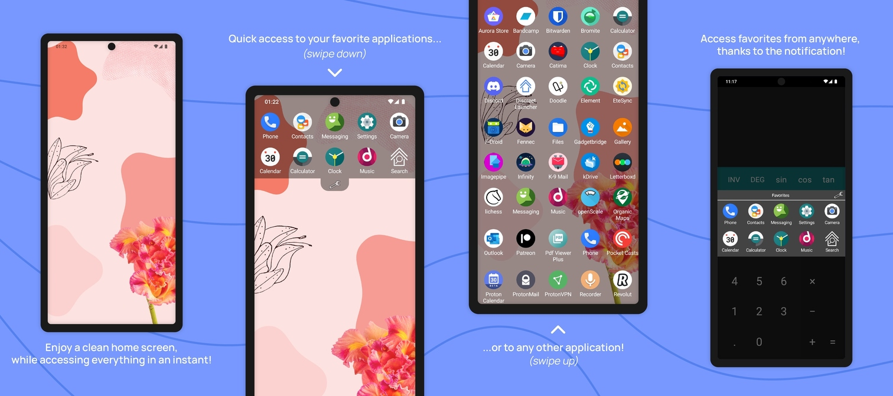

> [!WARNING]
> ## Archival of the project *(Archivage du projet)*
> This project has been archived and is no longer maintained, you can find more details in ticket [#378](https://github.com/falzonv/discreet-launcher/issues/378).
> *(Ce projet a été archivé et n'est plus maintenu, vous pouvez trouver plus de détails dans le ticket [#378](https://github.com/falzonv/discreet-launcher/issues/378).)*

# Discreet Launcher *(Lanceur Discret)*

Enjoy a clean home screen while accessing everything in an instant!  
*(Profitez d'un écran d'accueil épuré tout en accédant à tout en un instant !)*

**Available on [F-Droid](https://f-droid.org/en/packages/com.vincent_falzon.discreetlauncher)**
*(disponible sur [F-Droid](https://f-droid.org/fr/packages/com.vincent_falzon.discreetlauncher))*

  
Please note that the F-Droid build and publishing process is automatic and usually take 4 to 8 days to complete.
You may see a gap between the latest release and what is really available on F-Droid.  
*(Le processus de compilation et de publication par F-Droid est automatique et prend généralement 4 à 8 jours.
Il y a donc parfois une différence entre la dernière version et ce qui est disponible sur F-Droid.)*

## Screenshots *(Captures d'écran)*

